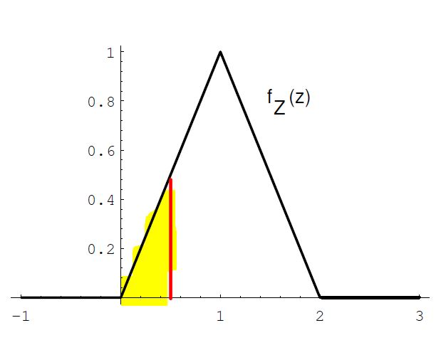
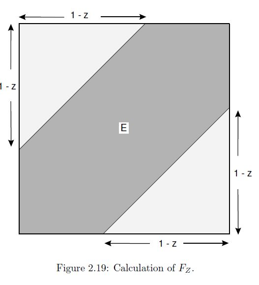

<style>
  .main-container {
    max-width: 1200px !important;
  }
</style>

---


# Setup
```{r setup, eval=T}
knitr::opts_chunk$set(echo = TRUE,
                      fig.pos='H')
directory = "C:/Users/Michael/Dropbox/priv/CUNY/MSDS/201909-Fall/DATA605_Larry/20190929_Week05/"
knitr::opts_knit$set(root.dir = directory)

### Make the output wide enough
options(scipen = 999, digits=12, width=150)

### no other libraries required this week
```

\newpage

# Part 1 - Proper probability distributions

### Choose independently two numbers B and C at random from the interval $[0,1]$ with uniform density. 
#### Prove that B and C are proper probability distributions.

p.59: **Definition 2.1** Let $X$ be a continuous real-valued random variable.    
A **density function for $X$** is a real-valued function $f$ which satisfies    
$$P(a \le X \le b) = \int_a^b f(x) dx$$ for all $a,b\in R$ . 

The uniform PDF on the interval [0,1] is defined as
$$f_X(x)= \left\{ 
\begin{matrix} 
0, & if\quad x\le0 \\ 
1, & \quad if\quad 0 \le x \le1 \\ 
0, & if\quad x \ge1 \end{matrix} 
\right. $$
Thus, the density is always non-negative, as required.   

For the uniform density function on the interval [0,1], $f(x) = 1$, so 
$$P(a \le X \le b) = \int_a^b 1\cdot  dx = b-a$$ 
for $0 \le a \le b \le 1$ .


P.60: The **probability** that the outcome of the experiment falls in an interval $[a, b]$ is given by    
$$P([a, b]) = \int_a^b f(x)dx$$ ,    
that is, by the area under the graph of the density function in the interval $[a, b]$.

For the interval [0,1], the probability is $$P(0 \le X \le 1) = \int_0^1 1\cdot  dx = 1-0 = 1$$
thus the total probability equals 1, as required.    


P.61: **Definition 2.2** Let X be a continuous real-valued random variable.     
Then the **cumulative distribution function** (CDF) of X is defined by the equation
$F_X(x) = P(X \le x)$ .

It is clear that X always takes on a value between 0 and 1, so the uniform **cumulative distribution function** of X is given by

$$F_X(x)= \left\{ \begin{matrix} 0, & if\quad x\le0 \\ x, & \quad if\quad 0 \le x \le1 \\ 1, & if\quad x \ge1 \end{matrix} \right. $$

The distribution is always non-negative, as required.   

Since $B$ and $C$ are independent and identially distributed to $X$, the above applies to each of $B,C$.

\newpage
# Part 2 - Probability of operations on B,C 

Note that the point (B,C) is then chosen at random in the unit square.
Find the probability that:

## (a) B + C < $\frac{1}{2}$.

The sum of two uniform variables corresponds to example 2.14 on pp. 63-64.

Let $Z = B+C$.  Then the PDF for $Z$ has positive density on the interval [0,2] and is defined as
$$f_Z(z)= \left\{ 
\begin{matrix} 
0, & if\quad z\le0 \\ 
z, & \quad if\quad 0 \le z \le 1 \\ 
2-z, & \quad if\quad 1 \le z \le 2 \\ 
0, & if\quad z \ge 2 \end{matrix} 
\right. $$

Density of the sum z is the large triangle from (0,0) to (1,1) to (2,0):    


The total area under this (large) triangle is $\frac{width * height}{2} =  2 \cdot 1 \cdot \frac{1}{2}=1$  .   

The CDF for $Z$ has positive density on the interval [0,2] and is defined as
$$f_Z(z)= \left\{ 
\begin{matrix} 
0, & if\quad z\le0 \\ 
\frac{z^2}{2}, & \quad if\quad 0 \le z \le 1 \\ 
1-\frac{(2-z)^2}{2}, & \quad if\quad 1 \le z \le 2 \\ 
1, & if\quad z \ge 2 \end{matrix} 
\right. $$

The region in which density $=z < \frac{1}{2}$ is the smaller triangle from (0,0) to ($\frac{1}{2}$,0) to ($\frac{1}{2}$,$\frac{1}{2}$), shaded in yellow.  

The area of this yellow triangle is  $\frac{width * height}{2} =  \frac{1}{2} \cdot \frac{1}{2} \cdot \frac{1}{2}=1(\frac{1}{2})^3 = 0.125 = \frac{1}{8}$ , which can be computed from the CDF for $z=\frac{1}{2}$ . Therefore, the **theoretical probability** is $\frac{1}{8}=0.125$ .    

#### Simulate sum of $Z=B+C < \frac{1}{2}$ :
```{r simul sum_below_half, eval=T}
n=1000000
B=runif(n,0,1)
C=runif(n,0,1)
Z=B+C
prob1 = sum(Z<=1/2)/n
# Probability that Z=B+C < 1/2 :
prob1
```
The **simulated probability** that $Z=B+C < \frac{1}{2}$ is `r prob1` .

\newpage
## (b) BC < $\frac{1}{2}$.

This has to be separated into two cases, the results of which will be summed for the final answer:

(1) if $B \le \frac{1}{2}$ then $C$ can take on any value $\in [0,1]$ and $B \cdot C \le \frac{1}{2}$ .     
On a grid plotting B vs. C, this will give a rectangle of width $\frac{1}{2}$ and height 1 for an area of $\frac{1}{2}$ .

(2) if $B > \frac{1}{2}$ then we must have $C < \frac{0.5}{x}$ in order for $B \cdot C \le \frac{1}{2}$ .    
On a grid plotting B vs. C, for $B \in [\frac{1}{2},1]$ this will give the following curve for C:


$$Z = \int\limits_{b=\frac{1}{2}}^{b=1} \left[ \frac{0.5}{c} \right] dc 
= \frac{1}{2} \log [c] \left| \begin{matrix} b=1 \\  &  \\ b=\frac{1}{2}\end{matrix} \right. 
= \frac{1}{2} \left[log(1) - log\left(\frac{1}{2}\right)\right]
= \frac{1}{2} \left[0 - log\left(\frac{1}{2}\right)\right]
= \frac{1}{2} \left[log\left(2)\right)\right]
= log(sqrt(2))$$


So, the **theoretical** answer is $Pr \left( Z=B \cdot C \le \frac{1}{2}\right) = \frac{1}{2} + \ln(\sqrt{2}) \approx 0.846574$

#### Simulate product $Z=B \cdot C < \frac{1}{2}$ :
```{r simul_product_below_half, eval=T}
n=1000000
B=runif(n,0,1)
C=runif(n,0,1)
Z=B*C
prob2 = sum(Z<=1/2)/n
# Probability that Z=B*C < 1/2 :
prob2
```

The **simulated probability** that $Z=B \cdot C < \frac{1}{2}$ is `r prob2` .

\newpage
## (c) |B - C| < $\frac{1}{2}$.

This corresponds to Example 2.16 on pp.65-66, and figure 2.19 on p.67:

Let $Z = |B-C|$.  Then the PDF for $Z$ has positive density on the interval [0,1] and is defined as
$$f_Z(z)= \left\{ 
\begin{matrix} 
0, & if\quad z\le0 \\ 
2(1-z), & \quad if\quad 0 \le z \le 1 \\ 
0, & if\quad z > 1 
\end{matrix} 
\right. $$

Then the CDF for $Z$ is defined as
$$F_Z(z)= \left\{ 
\begin{matrix} 
0, & if\quad z\le0 \\ 
1-(1-z)^2, & \quad if\quad 0 \le z \le 1 \\ 
1, & if\quad z > 1 
\end{matrix} 
\right. $$


For $z=\frac{1}{2}$ , the **theoretical probability** that $Pr \left( |B - C| < z=\frac{1}{2} \right)$ is
$$
\begin{aligned}
Pr \left(z=|B-C| \le \frac{1}{2} \right) 
= 1-\left(1-\frac{1}{2}\right)^2 
= 1-\left(\frac{1}{2}\right)^2 
= 1-\frac{1}{4} 
= \frac{3}{4} 
= 0.75
\end{aligned}
$$.



Removing the triangles of size $\frac{1}{8}$ from the square above yields the same result: $1 - \frac{1}{8} - \frac{1}{8} = \frac{6}{8} = \frac{3}{4} = 0.75$ .


#### Simulate difference $Z= |B-C| < \frac{1}{2}$ :
```{r simul-diff_below_half, eval=T}
n=1000000
B=runif(n,0,1)
C=runif(n,0,1)
Z=abs(B-C)
prob3 = sum(Z<=1/2)/n
# Probability that Z=|B-C| < 1/2 :
prob3
```

The **simulated probability** that $Z= |B-C| < \frac{1}{2}$ is `r prob3` .

\newpage
## (d) max{B,C} < $\frac{1}{2}$.

$$
\begin{aligned}
Pr \left( Z=max(B,C) < \frac{1}{2} \right) 
&= Pr \left( B< \frac{1}{2} \wedge C< \frac{1}{2} \right) \\
&= Pr \left( B< \frac{1}{2}\right) \cdot Pr \left( C< \frac{1}{2} \right) \\
&= \frac{1}{2} \cdot \frac{1}{2} \\
&= \frac{1}{4} \\
&= 0.25
\end{aligned}
$$

where the second equality comes from independence of $B$ and $C$ .

The **theoretical probability** that $Z=max(B,C) < \frac{1}{2}$ is $\frac{1}{2} \cdot \frac{1}{2} = \frac{1}{4} = 0.25$  .

#### Simulate max: $Z=max(B,C) < \frac{1}{2}$ :

```{r simul_max_below_half, eval=T}
n=1000000
B=runif(n,0,1)
C=runif(n,0,1)
Z1=cbind(B,C)
Z=apply(Z1,1,max)
prob4 = sum(Z<=1/2)/n
# Probability that Z=|B-C| < 1/2 :
prob4
```
The **simulated probability** that $Z=max(B,C) < \frac{1}{2}$ is `r prob4` .


\newpage
## (e) min{B,C} < $\frac{1}{2}$. 

$$
\begin{aligned}
Pr \left( Z=min(B,C) < \frac{1}{2} \right) 
&= Pr \left( \left( B < \frac{1}{2}\right) \vee \left( C< \frac{1}{2} \right) \right) \\
&= 1 - Pr \left( \left( B > \frac{1}{2} \right) \wedge \left(C > \frac{1}{2} \right) \right) \\
&= 1 - Pr \left( B > \frac{1}{2}\right) \cdot Pr \left( C > \frac{1}{2} \right) \\
&= 1 - \frac{1}{2} \cdot \frac{1}{2} \\
&= 1 - \frac{1}{4} \\
&= 0.75
\end{aligned}
$$

where the second equality stems from De Morgan's Law,   

https://en.wikipedia.org/wiki/De_Morgan%27s_laws     

and the third equality steps from independence of $B$ and $C$  .

The **theoretical probability** that $Z=max(B,C) < \frac{1}{2}$ is 
$1 - \frac{1}{2} \cdot \frac{1}{2} = 1 - \frac{1}{4} = \frac{3}{4} = 0.75$  .

#### Simulate min: $Z=min(B,C) < \frac{1}{2}$ :

```{r simul_min_below_half, eval=T}
n=1000000
B=runif(n,0,1)
C=runif(n,0,1)
Z1=cbind(B,C)
Z=apply(Z1,1,min)
prob5 = sum(Z<=1/2)/n
# Probability that Z=|B-C| < 1/2 :
prob5
```
The **simulated probability** that $Z=min(B,C) < \frac{1}{2}$ is `r prob5` .
